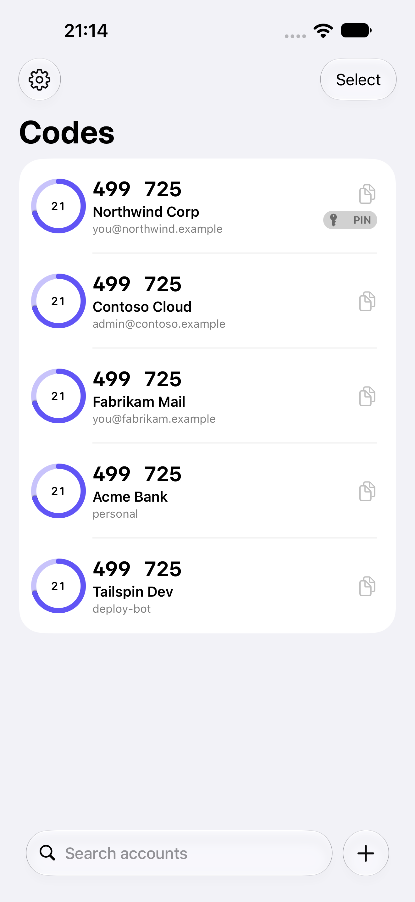
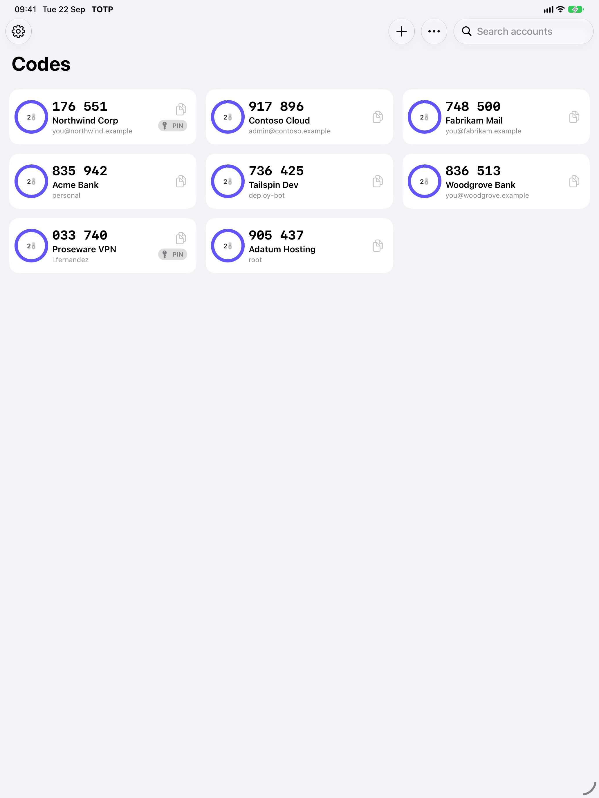

# TOTP Password

A secure, native TOTP (Time-based One-Time Password) authenticator app for iOS and macOS built entirely with SwiftUI and Apple frameworks.

<p align="center">
  
</p>

## Features

### 🔐 Security First
- **RFC 4226 & RFC 6238 Compliant** - Standard HOTP and TOTP algorithms
- **ChaChaPoly Encryption** - All OTP keys encrypted at rest
- **Keychain Storage** - Encryption keys stored securely in iOS/macOS Keychain
- **App Sandbox** - Full macOS sandbox compliance
- **No Third-Party Dependencies** - 100% Apple frameworks

### 📱 Cross-Platform
- Native iOS app (iPhone & iPad)
- Native macOS app (Apple Silicon & Intel)
- Shared codebase with platform-specific optimizations
- Universal purchase across all platforms

### 🎨 Modern UI/UX
- Liquid Glass design for iOS / iPadOS / macOS 27
- Adaptive layout driven by size classes: list on compact widths (iPhone, iPhone Duo folded), card grid on regular widths (iPad, iPhone Duo unfolded, Mac); all orientations
- Native swipe actions, context menus, search, pull-to-refresh and drag to reorder
- Select mode: batch-select accounts and delete them in one go
- iOS bottom bar with search and Add, like Notes
- Dynamic Type, VoiceOver labels and haptic feedback
- Fixed prefix (PIN) per account, added on copy and AutoFill (services that expect PIN + code)

### ☁️ Sync & Backup
- iCloud sync via CloudKit
- App Groups for widget data sharing
- Encrypted backups

### ⚡ Widgets, Controls & Shortcuts
- Home Screen widgets (small, medium, large) and Lock Screen widgets
- Tap a widget to copy the code (prefix included)
- Control Center / Action button control to copy a code in one tap
- Siri, Shortcuts and Spotlight: "Copy my TOTP code for …", "Get code"

### 📷 Setup
- Scan the setup QR code with the camera, pick a QR screenshot, or paste an `otpauth://` link
- SHA-1, SHA-256 and SHA-512; 6–10 digits; custom periods

### 🔑 AutoFill & Security
- AutoFill credential provider on iPhone, iPad **and Mac**: fills one-time-code fields, and password fields with PIN + code
- Optional Face ID / Touch ID / Optic ID lock
- Copied codes are cleared from the clipboard automatically (configurable)

## Screenshots

| iPhone | iPad | macOS |
|--------|------|-------|
|  |  |  |

## Installation

### Requirements
- iOS / iPadOS 27+ / macOS 27+
- Xcode 27+

### Build from Source

```bash
# Clone the repository
git clone https://github.com/lucferbux/TOTP.git
cd TOTP

# Open in Xcode
open TOTP.xcodeproj
```

### App Store
Coming soon to the App Store.

## Usage

### Adding an Account

1. Tap **+** (or ⌘N)
2. Scan the QR code, choose a QR image, or paste the `otpauth://` link — or enter the Base32 secret manually
3. Optionally add a fixed prefix (PIN) and AutoFill domains
4. Tap **Add**

### Copying Codes

- **Tap** any account card to copy the code
- Code is copied to clipboard with haptic feedback
- A toast notification confirms the copy

### Managing Accounts

- **Swipe** a row for Copy, Edit and Delete (iPhone), or **long press / right-click** for the context menu
- **Select** (top right) to tick several accounts and delete them together
- **Pull down** to refresh accounts

## Architecture

```
Shared/            # Compiled into the app, widget and AutoFill targets
├── OTP/           # HOTP/TOTP (RFC 4226 / 6238, SHA-1/256/512)
├── Model/         # OtpModel, encrypted AccountStore, key manager, Base32, otpauth:// parser
└── Platform/      # ClipboardManager + shared preferences
SharedIntents/     # App Intents (app + widget): AccountEntity, Get/Copy Code
TOTP/              # App: views, SyncManager, CloudKit, app lock, Siri phrases
TOTP Widget/       # Widgets and the Copy Code control
TOTP AutoFill/     # Credential provider extension (iOS + macOS)
```

See [docs/ARCHITECTURE.md](docs/ARCHITECTURE.md) and [CLAUDE.md](CLAUDE.md).

### Key Technologies

| Component | Technology |
|-----------|------------|
| UI | SwiftUI |
| Cryptography | CryptoKit (HMAC-SHA1/256/512, ChaChaPoly) |
| Storage | UserDefaults + Keychain |
| Sync | CloudKit |
| Widget | WidgetKit, App Intents |
| Testing | Swift Testing |

## Security

### How Keys Are Protected

1. **Encryption**: All OTP secret keys are encrypted using ChaChaPoly before storage
2. **Key Management**: The master encryption key lives in the App Group container (readable by the widget and AutoFill extensions, protected until first unlock)
3. **App Groups**: Widget access uses shared encrypted storage with the same key
4. **No Plaintext**: Keys are never stored or transmitted in plaintext

### Best Practices

- Enable device passcode/biometrics
- Keep your device updated
- Never share your secret keys

## Development

### Running Tests

```bash
# Run all tests
xcodebuild test -scheme TOTP -destination 'platform=iOS Simulator,name=iPhone 18 Pro'

# Unit tests only
xcodebuild test -scheme TOTP -destination 'platform=iOS Simulator,name=iPhone 18 Pro' -only-testing:TOTPTests
```

### Code Style

This project follows the [Swift API Design Guidelines](https://swift.org/documentation/api-design-guidelines/) and uses SwiftLint (coming soon).

### Contributing

1. Fork the repository
2. Create a feature branch (`git checkout -b feature/amazing-feature`)
3. Commit your changes (`git commit -m 'Add amazing feature'`)
4. Push to the branch (`git push origin feature/amazing-feature`)
5. Open a Pull Request

See [CONTRIBUTING.md](docs/CONTRIBUTING.md) for detailed guidelines.

## Roadmap

See [RFE.md](docs/RFE.md) for the full feature roadmap including:

- 🔜 Apple Watch app
- 🔜 Import/Export functionality

## License

This project is licensed under the MIT License - see the [LICENSE](LICENSE) file for details.

## Acknowledgments

- [RFC 4226](https://tools.ietf.org/html/rfc4226) - HOTP Algorithm
- [RFC 6238](https://tools.ietf.org/html/rfc6238) - TOTP Algorithm
- Apple's CryptoKit team for excellent cryptographic APIs

## Support

- 📫 [Open an Issue](https://github.com/lucferbux/TOTP/issues)
- 💬 [Discussions](https://github.com/lucferbux/TOTP/discussions)

---

<p align="center">
  Made with ❤️ using SwiftUI
</p>
